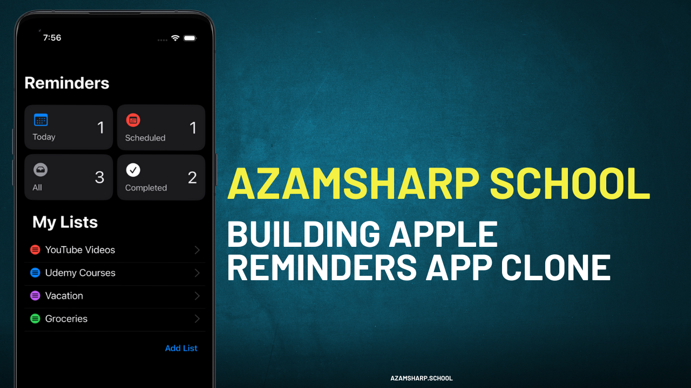

# Reminders App 

Discover your potential by enrolling in our hands-on course, where you'll use SwiftUI and SwiftData to completely clone the Apple Reminders app. This course, which is ideal for all skill levels, covers effective data management, intuitive user interface design, and crucial app features like task creation and notifications. Additionally, you will discover how to use CloudKit and iCloud to sync data between devices.

[Watch on YouTube](https://www.youtube.com/watch?v=om9IloU7Lqc&list=PLDMXqpbtInQgFOoRkbRnMHEAyJs3qB8Dm)